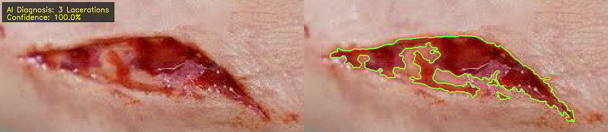

# RoboDoc v2 - AI Injury Classification & Analysis

<div align="center">
  
</div>

<div align="center">
  
  
  
  
  
  
</div>

**RoboDoc v2** represents a significant advancement in the RoboDoc project series, introducing AI-powered injury classification with professional medical interface design and comprehensive analysis capabilities.

<div align="center">
  
</div>

## 🎥 Demo Video

<div align="center">
  
  <br><br>
  <em>RoboDoc v2 demonstration showing AI-powered injury classification workflow</em>
  <br>
  <sub><a href="demo_video.mov">Download full-quality video (.mov)</a></sub>
</div>

## 🏛️ Affiliation

**MSA University**  
Faculty of Biotechnology  
Prototyping Lab  

**Authors:** Nehal Alaa, Nour Marwan, Radwa Kamal, Ahmed Gomaa  
**Date:** December 2023

## 🔬 Overview

RoboDoc v2 introduces AI-powered injury classification capabilities with a professional medical interface. The system combines advanced computer vision techniques with deep learning models to provide accurate injury diagnosis and detailed analysis reports suitable for clinical environments.

### Features
- **AI-Powered Classification**: TensorFlow/Keras model for accurate injury diagnosis
- **Professional Medical Interface**: Clinical-grade GUI designed for healthcare environments
- **Comprehensive Analysis Pipeline**: Computer vision + AI classification in unified workflow
- **Export Capabilities**: Annotated results with AI diagnosis and metadata files
- **Real-Time Parameter Adjustment**: Interactive controls for optimal analysis

### 🤖 AI Classification System
The integrated Keras model (`keras_model.h5`) classifies injuries into 6 medical categories:

| Class | Injury Type | Description |
|-------|-------------|-------------|
| **0** | First Degree Burn | Superficial burns affecting only outer skin layer |
| **1** | Second Degree Burn | Burns affecting outer and underlying skin layers |
| **2** | Third Degree Burn | Severe burns through all skin layers |
| **3** | Lacerations | Cuts or tears in the skin tissue |
| **4** | Skin Ulcer Wound | Open sores on skin surface |
| **5** | No Wound/Healthy Skin | Normal healthy tissue without injury |

## 📁 Repository Structure

```
robodoc-v2/
├── robodoc.py                 # Enhanced main application
├── tfmodel.py                 # AI model interface and prediction functions
├── keras_model.h5             # Pre-trained Keras classification model
├── labels.txt                 # Class labels for AI model
├── demo_video.gif             # Animated demonstration
├── demo_video.mov             # High-quality video demonstration
├── test_images/               # Sample test images for validation
├── sample_results/            # Example analysis outputs
├── logos/                     # Affiliation logos
├── requirements.txt           # Python dependencies
└── README.md                  # This documentation
```

## 🚀 Quick Start

### Prerequisites
- Python 3.8 or higher
- CUDA-compatible GPU (recommended for faster AI inference)
- Minimum 8GB RAM, 16GB recommended

### Installation

1. **Clone/Download the repository**
```bash
git clone https://github.com/nehal404/robodoc_v2
cd robodoc-v2
```

2. **Install dependencies**
```bash
pip install -r requirements.txt
```

3. **Verify model files**
Ensure `keras_model.h5` and `labels.txt` are present in the root directory.

### Run Application
```bash
python robodoc.py
```

## 🖥️ Interface

### Four-Step Analysis Workflow

#### Step 1: Upload Injury Image
- Support for multiple formats: PNG, JPG, JPEG, BMP, TIFF
- Automatic image validation and dimension display
- Professional file browser integration

#### Step 2: Select Control Region
- Interactive crop tool for healthy tissue selection
- Professional dialog with zoom and pan capabilities
- Automatic scaling for optimal display

#### Step 3: Parameter Adjustment
- **Injury Detection Sensitivity** (3-190): Fine-tune detection threshold
- **Spray Pattern Tightness** (1-50): Adjust overlay pattern density
- Real-time parameter feedback

#### Step 4: AI Analysis & Export
- **Analyze & Classify**: Trigger comprehensive analysis
- **Save Analysis**: Export annotated results with AI diagnosis
- **Export Contours**: Save isolated contours with metadata

## 📊 Model Performance

### Confidence Scoring
- **High Confidence (≥80%)**: Green indicators - Reliable for clinical reference
- **Medium Confidence (60-79%)**: Orange indicators - Consider additional evaluation  
- **Low Confidence (<60%)**: Red indicators - Manual verification recommended

## 🆕 Version 2 Enhancements

### Major Upgrades from v1
- **AI Integration**: Added TensorFlow/Keras classification model
- **Professional Interface**: Complete UI redesign for clinical environments
- **Enhanced Workflow**: Streamlined 4-step analysis process
- **Advanced Export**: Annotated results with AI diagnosis overlay
- **Metadata System**: Comprehensive analysis documentation
- **Confidence Scoring**: Reliability assessment for clinical use

## 📄 File Specifications

### Model Files
- **keras_model.h5**: Pre-trained classification model (TensorFlow/Keras format)
- **labels.txt**: Class label mappings for AI predictions
- **tfmodel.py**: Model interface and prediction functions

### Output Files
- **Analysis Results**: Annotated images with AI diagnosis overlay
- **Contour Exports**: Transparent PNG files for overlay applications
- **Metadata Files**: Comprehensive analysis documentation in text format

## 🔄 Integration with RoboDoc Series

This is **Version 2 of 7** in the complete RoboDoc medical imaging project:
- ✅ **v1** - Static Image Segmentation & Analysis
- ✅ **v2** - AI-Powered Classification & Professional Interface *(Current)*


<div align="center">
  
  
  
  
</div>

<div align="center">
  <strong>🏥 MSA University - Faculty of Biotechnology - Prototyping Lab 🏥</strong>
  <br>
  <sub>December 2023 • RoboDoc Project v2/7 • AI-Powered Medical Analysis Platform</sub>
</div>
